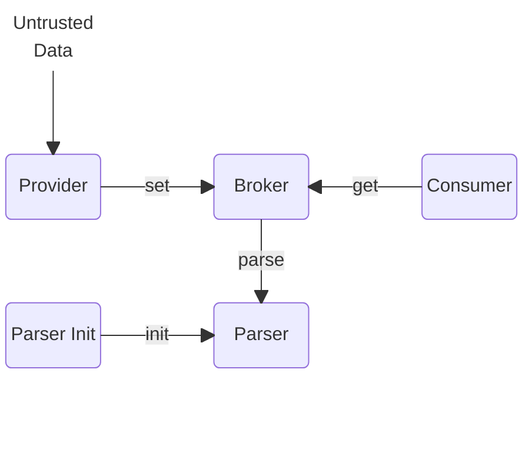
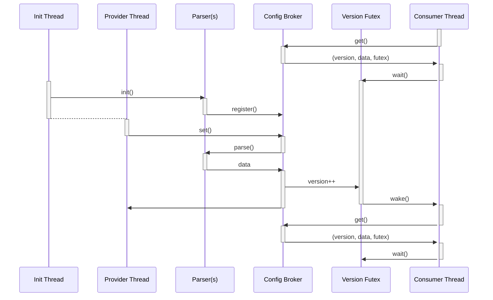
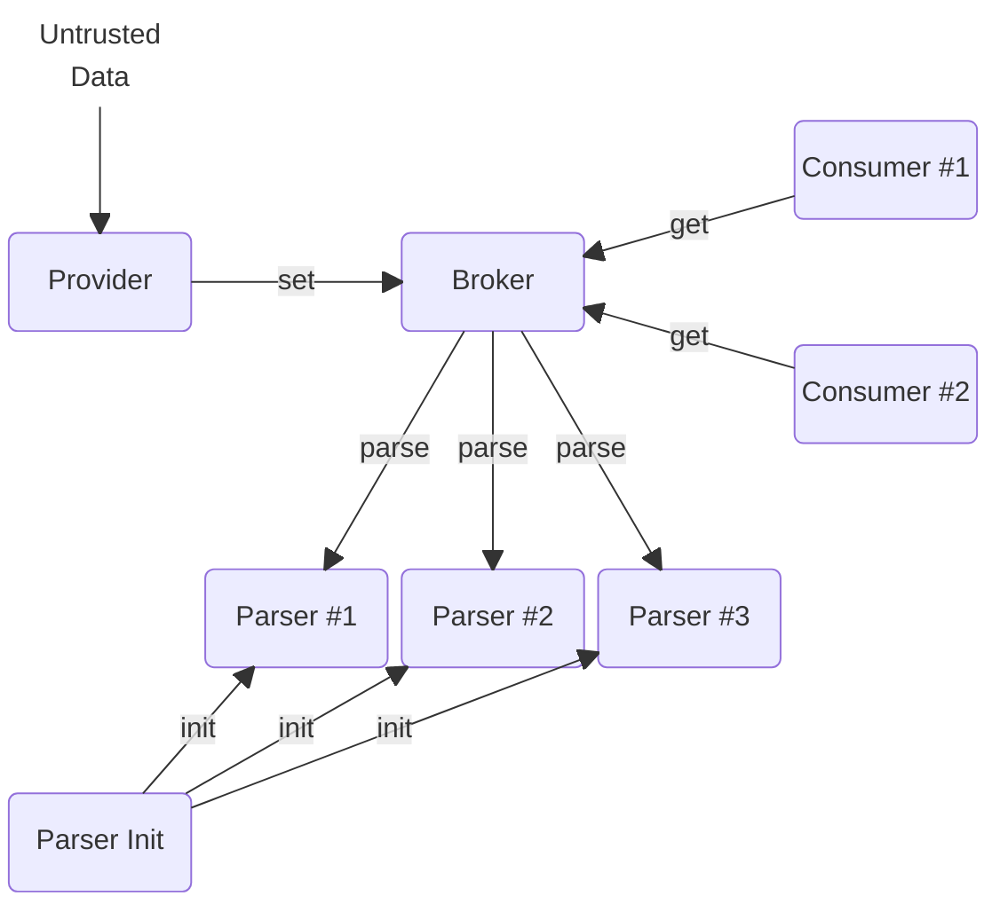
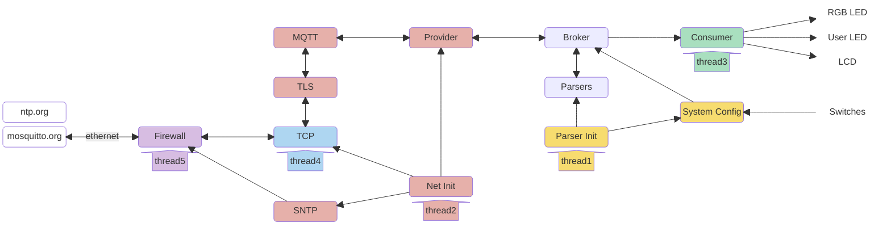

Safe Configuration Management
=============================

Contributed by Configured Things Ltd

All systems rely on some form of configuration data, and the configuration interface is a significant part of the attack surface.
Misconfiguration, whether accidental or malicious, is one of the main sources of security vulnerabilities.
Purely immutable systems, where configuration is baked in at build time, may work for container based environments where re-deployment is relatively easy but are not an option for embedded systems.  
The solution in many cases is to create an often complex trust model around and within the configuration system to limit and control configuration changes, where the complexity itself adds to the risk profile. 

This example shows how the CHERIoT features can be used to create a system where configuration data can be received from an external source and securely and safely distributed to a number compartments with a simple and minimal trust model.
This supports, for example, an architecture where third party components can be safely integrated and dynamically configured.

There are three main aspects to the security model:
* Static Sealed Capabilities are used to define which compartments can modify and/or consume configuration data, and how much memory each configuration item can consume.  
As well as providing run time controls this aspect of the configuration can be audited at build time.

* A configuration broker provides an abstraction layer between providers and consumers of configuration data, enabling the trust model to be expressed only in terms of the relationships with the broker.

* A sandbox compartment in which untrusted data can be verified and converted to trusted configuration values.

The core Configuration Broker has been written to be generic and directly reusable, and has no dependencies on the specific configuration items being managed.
To builds (ibex-sim and Sonata) are provided to show how this can then be incorporated into systems, with supporting code to deal with specific configuration items.
All are example of how to develop such components using CHERIoT features such as static sealed capabilities, memory claims, locks, event-waiters, and sandbox compartments for handling untrusted data.

Providing a generic broker and expressing the trust model via its interfaces makes it possible to add support for new configuration items without having to re-evaluate the trust model each time. 

# Table of Contents
- [Safe Configuration Management](#safe-configuration-management)
- [Table of Contents](#table-of-contents)
- [Overview](#overview)
  - [Interactions and Trust Model](#interactions-and-trust-model)
    - [Parsers](#parsers)
      - [Integrity](#integrity)
      - [Confidentiality](#confidentiality)
      - [Availability](#availability)
    - [Providers](#providers)
      - [Confidentiality](#confidentiality-1)
      - [Integrity](#integrity-1)
      - [Availability](#availability-1)
    - [Consumers](#consumers)
      - [Confidentiality](#confidentiality-2)
      - [Integrity](#integrity-2)
      - [Availability](#availability-2)
- [Initalisation](#initalisation)
- [Repository Structure](#repository-structure)
- [IBEX Simulator](#ibex-simulator)
  - [Threads](#threads)
  - [Configuration Data](#configuration-data)
    - [RGB LEDs](#rgb-leds)
    - [User LEDs](#user-leds)
    - [Logger](#logger)
  - [Build Instructions (Dev container)](#build-instructions-dev-container)
- [Sonata](#sonata)
  - [Threads](#threads-1)
  - [Build Instructions (Dev container)](#build-instructions-dev-container-1)


# Overview

Each item of configuration data has a name, a value, and a version.
New values are supplied as serialised JSON and parsed into a corresponding data structure. 

There are four main roles:
* Providers are authorised to supply the values for one or more items.
* Consumers are authorised to receive the values of one or more items.
* Parsers are authorised to register the method which parses new values from Providers into verified values for Consumers. 
* The Broker provides an abstraction layer between Providers and Consumers; it holds the current value and maintains the version for each item.
The Broker is passive, in that it only responds to calls from a Provider or Consumer.
All operations take place on a thread calling into the Broker, and it only calls out to the Parser.

Providers, Consumers, and Parsers are assigned their rights via Static Sealed Capabilities, which only the Broker can unseal.
This means this aspect is fixed at build time and is auditable.

The general compartment model is therefore something like:  



The model can be thought of as similar to a pub/sub architecture with a single retained message for each item and a security policy for clients defined at build time through static sealed capabilities.
The configuration data is declarative so there is no need or value in maintaining a full sequence of updates; each new version is a complete definition of the required configuration item. 
Aligned with the pub/sub model publishing items and subscribing for items can happen in any sequence; a consumer will receive any data that is already published, and any subsequent updates.
This avoids any timing issues during system startup.

The following sequence diagram shows how a provider thread and a consumer thread interact with the broker to turn untrusted data in the Provider to trusted data in the Consumer.  



In the demo new values are provided as serialised JSON strings.
Depending on the build target these are either predefined test data (ibex-sim) or come via MQTT (Sonata). 
The Provider is in effect simply an authorised mapping between the topics and configuration items.
The Parsers and Consumers contain code which is specific to each item.
The Broker is agnostic to the details of configuration items, and has no prior knowledge of which items exist.

## Interactions and Trust Model
Because the Broker provides an abstraction between Providers, Consumers and Parsers all of the interactions can be described in terms of their interactions with the Broker rather than each other.

### Parsers
The parsers have the key role of converting untrusted data received from the network into verified and trusted configuration values.
In traditional systems parsers are vulnerable to a range of attacks such as injection and buffer overflow.
Using CHERIoT each parser runs as a stateless method (using heap controls) in its own a sandbox compartment which ensures that any issues are contained to failing only the current parse operation.
Parsers are given a static sealed capability for each item type they are allowed to parse, which includes two properties of the item.
* The size of the object they will produce.
* The minimum interval in milliseconds between updates.
They use this to register with the Broker, which is the only compartment that can unseal the capability.
The Broker will only call registered parsers, which are passed as cheri_callbacks so they are not callable by any other compartment.
The Broker only passes non global capabilities to the Parser, so the Parser is unable to capture them.

The Broker uses the size in the sealed capability to allocate a new buffer for each update.
If the parsing of the new value results in access beyond this size then that will trigger a bounds violation that fails the parse. 

The interval reflects that parsing an object and/or applying updates can can be expensive tasks, and protects against DoS attacks from a compromised Provider.
The Broker will reject without attempting to parse any updates that are made less that min_interval since the last attempt. 

Parsers that can run without any heap interaction could be co-located in the same sandbox.
In the demo we use a combination of a CHERIoT library wrapper to coreJSON from FreeRTOS and magic_emun, which requires a small amount of heap manipulation.
Running each parser in its own sandbox compartment with a small heap quota prevents any risk of interaction between the different configuration item types even if there is some persistent heap based attack on the parser.  

#### Integrity
The Broker trusts that the Parser will correctly populate the object, but this can be established by code inspection & testing.
Because the Parser can only be invoked by the Broker and is stateless it's correct operation can not be compromised. 

The Parser has no need for trust in the Broker; if it is passed the wrong size buffer the operation will simply fail, or result in a partly populated object.

#### Confidentiality
The Broker ensures that Parser can not capture the capabilities passed as parameters.

The Parser is not allowed to persist state in the heap. 

#### Availability
The Broker trusts that the Parser will not block only to the extent that it provides this guarantee to the Provider;  The Broker itself is still able to serve other configuration items.

### Providers
Providers have one or more WRITE_CONFIG_CAPABILTY(s) that define the name of each item they are allowed to update. They request the broker to update the value of an item by passing it
* The sealed capability granting permission to update the item.
* A read-only string of serialised JSON.

Assuming the capability is valid, the Broker will allocate the required space from the heap (defined by the Parser and not the Publisher) and invoke the Parser.

If the parse is successful the Broker will notify any consumers by updating the version.

#### Confidentiality
The Publisher is trusting the Broker will only make the data available to compartments that have the corresponding sealed read capability.
This can be verified by code inspection and auditing the static sealed capabilities.

#### Integrity
Only a Provider with the corresponding sealed capability can request an update. 

The data object is created from a read only JSON string, and stored in heap space allocated by the Broker.
There is no path for the publisher to affect the integrity of the data after it has been successfully parsed.   

The Broker only maintains a read only pointer to the parsed data, so neither it nor a consumer can mutate it.

#### Availability
The Provider can not make the Broker consume more of its heap that the 2x the size defined in the corresponding sealed capability of the Parser (current version + new version).

The Provider can not make the Broker attempt to parse it's data more often that the minimum interval defined in the corresponding sealed capability of the Parser.

The Provider is trusting the Broker, and indirectly the Parser, not to block its thread.


### Consumers
Consumers have one or more READ_CONFIG_CAPABILITY(s) that define which items they are allowed to receive.

Consumers can request the current value at any time by passing their sealed capability to the Broker.
In return they receive a data structure with four values:
* The name of the item. 
* A read only pointer the current data value (which maybe null if it hasn't been set yet).
* The current version.
* A read only pointer to a futex they can wait on for the version to change.

The normal pattern for a consumer is to have a thread which makes an initial call to get as a minimum the current version and futex to wait on, process the current value (if any) and then wait for changes. 

The Broker allocate heap space for each new version of the data, which it releases when a new value becomes available.
Consumers must assert their own claims and fast_claims to keep the value available to them for as long as they need it. 

As with the Provider the extent to which the Broker trusts a Consumer is encapsulated in the sealed capability, so it is only "trusting" something which can be audited at build time.

#### Confidentiality
Only a Consumer with the sealed capability can request an item.

#### Integrity
The consumer is only given a read capability to the item, so it can not mutate it.

The Broker will only ever give the Consumer values that have been successfully parsed.

#### Availability
The Consumer is trusting that the Broker wil notify it when new versions are available. 

The Consumer can not affect the Brokers heap quota; if the Consumer fails to make or release a claim it only affects itself.

The Consumer is trusting that Broker will not block it's thread when it reads a value.
It has control over when it's thread waits on the futex for a new version, and for how long to wait. 

# Initalisation
A key aspect of the design is to be able to add new configuration items just by creating the associated sealed capabilities and assigning them to the appropriate compartments.
To support this approach each parser must register with the broker.
This is turn creates an initialisation issue as the parsers do not have their own thread (the run on the thread that want's to set a vew value), and CHERIoT has no general init mechanism.
Ideally we would restrict the scope of who can call a parser to just the config-broker, but that would require the broker to know about all parsers.
Instead we start one thread in a build-specific parser-init compartment, that calls each of the parsers init methods before transferring into the provider compartment.  This allows us to still assert limits around which compartments access to the parsers. 

# Repository Structure
The demo can be built for two targets.
* ibex-safe-simulator provides a self contained demo that can run in the dev container and shows the principles of the broker in operation.  
* sonata provides a deployment for a sonata board using the user and RGB LEDs with data provided by the MQTT network stack.

To support these two builds, and show how the common aspects of the broker can be used in other systems, the code is structured as follows:

**/common** - code that is independent from specific configuration items

**/config** - definitions of configuration data and the associated parsers

**/ibex-safe-simulator** - demo providers and consumers that do not need h/w

**/sonata** - MQTT network provider and Sonata configuration consumers

_/config could be considered platform specific, but in this example some data types and parsers are common to both builds._

```
├── common
│   ├── config_broker
│   │   └── << Generic Config broker compartment >>
│   ├── config_consumer
│   │   └── << Generic consumer library >>
│   ├── json_parser
│   │   └── << A wrapper to the coreJSON module >>
│   └── third_party
│       └── coreJSON
│           └── << a copy of the freeRTOS coreJSON module >>
|
├── config
│   ├── include
│   │   └── << Header files defining configuration item data structures >>
│   ├── parser_helper.h
│   └── parsers
│       └── << Parsers for each configuration item >>
|
├── ibex-safe-simulator
│   ├── consumers
│   │   └── << Example consumers >>
│   ├── init
│   │   └── << Build specific parser initialiser >>
│   ├── provider
│   │   └── << A test stub that acts like an MQTT client >>
│   └── xmake.lua
|
├── sonata
│   ├── consumers
│   │   └── << Example consumers >>
│   ├── init
│   │   └── << Network and build specific parser initialiser >>
│   ├── provider
│   │   └── << A test stub that acts like an MQTT client >>
│   ├── system_config
│   │   └── << A configuration item generator >>
│   ├── third_party
│   │   └── << Sonat LCD display driver >>
│   └── xmake.lua

```


# IBEX Simulator

This build provides something akin to test case for the broker;  It runs to completion using test data and with no external dependencies. 



## Threads
A thread which starts in the MQTT stub provides a sequence of valid and invalid configuration values from the corresponding topics. 

There are two Consumers in the demo, each implemented as separate compartments.

Consumer #1 is authorised to receive the RGB LED configuration.
Consumer #2 is authorised to receive the User LED configuration.
Both consumers are authorised to receive the Logger configuration.
The latest logger configuration is used when updating the LED configurations to show the use of heap claims to kept a value available between updates.

A thread is started in each consumer which waits for new versions to become available and then, to keep the demo h/w agnostic, makes a library call to print the received value.

The demo uses the "ibex-safe-simulator" board as its target, since this provides a realtime clock.
This allows the Provider to sleep between messages giving the Consumers a chance to run.    

## Configuration Data

The demo uses three configuration values; two based on Sonata board and a third more contrived for the demo.
The values are mix of strings, numbers, and enumerations.  

### RGB LEDs
Sets the colour of the two RGB LEDs
```json
{
    "led0": {"red": 100, "green": 100, "blue": 100},
    "led1": {"red": 200, "green": 200, "blue": 200},
}
```
Values must be 0-255

### User LEDs
Sets the state of the eight User LEDs 
```json
{
  "led0": "on",
  "led1": "off",
  "led2": "ON",
  "led3": "OFF",
  "led4": "Off",
  "led5": "On",
  "led6": "off",
  "led7": "On"
}
```
Values are not case sensitive.

### Logger
A contrived example to include a string (to show buffer overflow handling) and which has multiple consumers.
To show an alterative parser this expects the data to be supplied in binary rather than JSON. 
The C++ definition of configuration structure is 
```c++
enum class logLevel
{
	Debug = 0,
	Info  = 1,
	Warn  = 2,
	Error = 3
};

struct Host
{
	char     address[16]; // ipv4 address of host
	uint16_t port;        // port on host
};

struct Config
{
	Host     host;  // Details of the host
	logLevel level; // required logging level
};
```

## Build Instructions (Dev container)

```
cd configuration_broker/ibex-safe-simulator
xmake config --sdk=/cheriot-tools -P .
xmake
xmake run
```

# Sonata

The Sonata build combines the configuration broker with the network stack to interact with an external MQTT broker to receive configuration and publish status.

The following diagram shows the compartments and provides an indication of the scope of the various threads.
_Threads are, of course, orthogonal to compartments so this should be seen only as indication of the boundaries between threads ._ 



The demo requires that the Sonata board has an ethernet connection to a network that provides DHCP, DNS, and access to pool.ntp.org and mqtt.mosquitto.org.

## Threads
Thread #1 performs the initialisation of the parsers and then loops in the _System Config_ compartment where it generates a "systemConfig" configuration item by reading the values of the switches on the Sonata board.
```c++
namespace systemConfig
{

	const auto IdLength = 16;

	struct Config
	{
		char id[IdLength];
		bool switches[8];
	};

}
```

The _id_ value is used to determine which MQTT topics to use, and is the combination of a randomly generated string and the numeric value of the first two switches, for example "ghdyeosp_1".
Changing the switches changes the id causes the system to subscribe to a different set of topics.
If the broker is populated with a collection of persistently published messages this allows a board to move between different configurations without having to republish the messages to MQTT.
The random string can be replaces with a fixed name by passing a system-id value to xmake config
```
   xmake f --system-id=MySystem --IPv6=n  --sdk=/cheriot-tools -P .
```

Thread #2 performs the network initialisation and then loops in the _provider_ compartment handing the interaction with the MQTT broker.
It responds to changes to the _System Config_ (which it gets from the _config broker_ ) by changing the topics it is subscribed to and by publishing the status.
The topics used are:
   sonata-config/Config/<system-id>/user_LED 
   sonata-config/Config/<system-id>/rgb_LED
   sonata-config/Status/<system-id> 

The values published to the two Config topics are the JSON strings described in [Configuration Data](#configuration-data).

Thread #3 loops in the _consumer_ compartment and responds to changes in the coinfiguration data by updating the LEDs and LCD on the Sonata board. 

Threads #4 and #5 are the standard TCP and Firewall threads required by the Network stack. 

## Build Instructions (Dev container)

The network stack takes a lot of extra resources, so the example is built without IPv6 support.
```
cd configuration_broker/sonata
xmake config --IPv6=n --sdk=/cheriot-tools/ -P .
xmake
xmake run
```

The system connects to the same public MQTT broker (test.mosquitto.org) used by the HughTheLightBulb demo. 
By default the demo will create a random eight character string to use in the MQTT topics.
The --system-id parameter can be passed to xmake config to give the build a determistic system id.
```
xmake config --IPv6=n --system-id=MySonata --sdk=/cheriot-tools/ -P .
```

Status is published to the topic
sonata-config/Status/<Id>-<#>
where <Id> is the generated or configured IS, and <#> is generated from switches 0 & 1 on the board.

Configuration is set by publishing a JSON string to
sonata-config/Config/<Id>-<#>/<config>
where <config> is one of user_LED or RGB_LED

for example:
user_LED
```+json
{"led0":"On","led1":"Off","led2":"Off","led3":"Off","led4":"Off","led5":"On","led6":"Off","led7":"On"}
```

rbg_LED
```+json
{"led0":{"red":0,"green":40,"blue":40},"led1":{"red":50,"green":0,"blue":0}}
```


